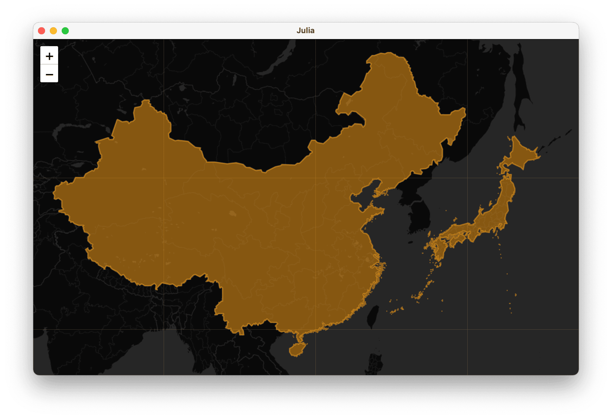

# Leaflet

[](https://JuliaGeo.github.io/Leaflet.jl/stable)
[](https://JuliaGeo.github.io/Leaflet.jl/dev)
[](https://github.com/JuliaGeo/Leaflet.jl/actions/workflows/CI.yml)
[](http://codecov.io/github/yeesian/Leaflet.jl?branch=main)

LeafletJS maps for Julia.

This package integrates with WebIO.jl to render leaflet maps for outputs like 
Blink.jl, Mux.jl, and for Jupyter notebooks.

All [GeoInterface.jl](https://github.com/JuliaGeo/GeoInterface.jl) compatible geometries can be displayed as layers.

A basic example, where we use GADM to download a country boundary shapefile,
and plot them over the CARTO `:dark_nolabels` base layers.

```julia
using Leaflet, Blink, GADM
layers = Leaflet.Layer.([GADM.get("CHN").geom[1], GADM.get("JPN").geom[1]]; color=:orange); 
provider = Providers.CartoDB()
m = Leaflet.Map(; layers, provider, zoom=3, height=1000, center=[30.0, 120.0]);
w = Blink.Window(; body=m)
```

